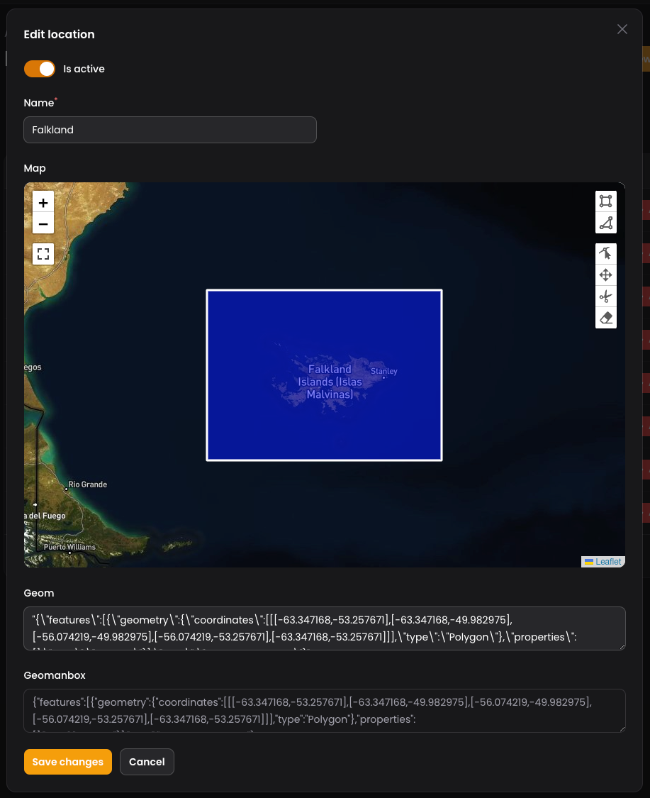
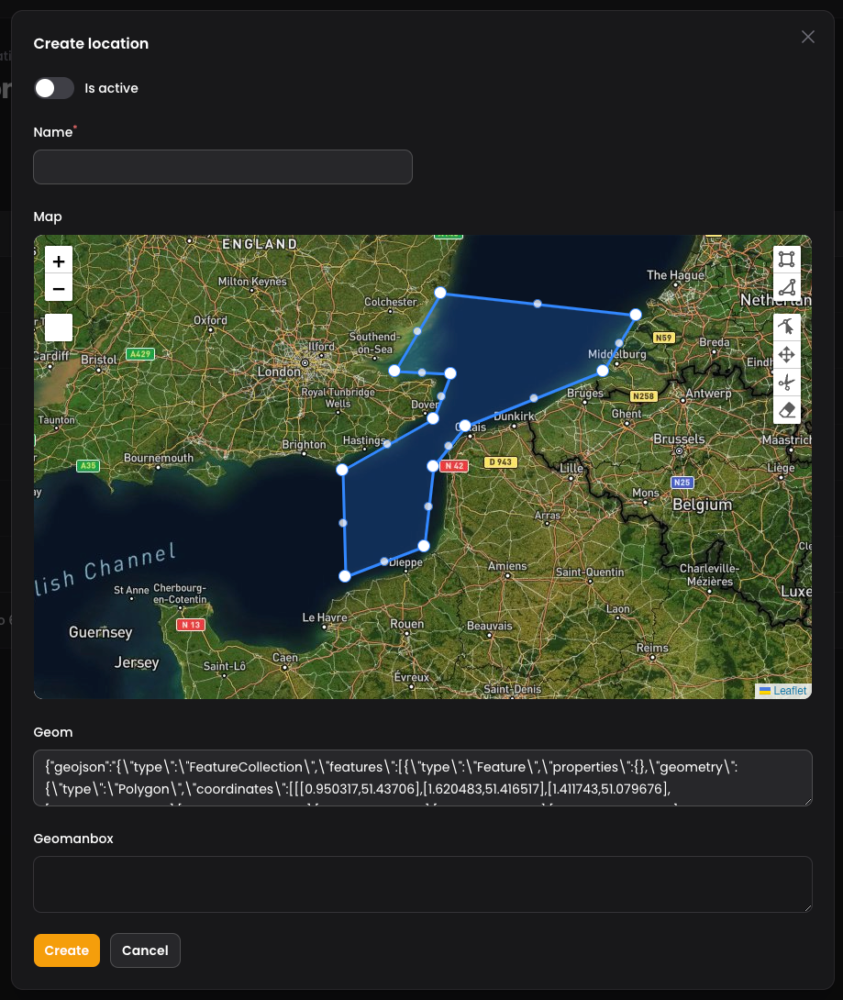

# Filament V3 Map Picker + Geoman Drawing Plugin

[![Latest Version on Packagist][ico-version]][link-packagist]
[![Total Downloads][ico-downloads]][link-downloads]
[![Software License][ico-license]][link-license]



## Introduction 

Map Picker is a custom field of Filament designed to simplify the process of selecting a location on a map and obtaining its 
geo-coordinates with the ease of having the Geoman plugin embedded in the map.

* Features include: 
   * A Field for Filament-v3 with Leaflet Map Integration
   * Receive Real-time Coordinates Upon Marker Movement Completion
   * Tailor Controls and Marker Appearance to Your Preferences
* Latest versions of PHP and Filament
* Best practices applied:
  * [`README.md`][link-readme] (badges included)
  * [`LICENSE`][link-license]
  * [`composer.json`][link-composer-json]
  * [`.gitignore`][link-gitignore]
  * [`pint.json`][link-pint]

## Supported Maps

Map Picker currently supports the following map:

1. Open Street Map (OSM)
2. Google Maps

## Installation

You can easily install the package via Composer:

```bash
composer require doode/filament-map-picker
```

## Basic Usage

Resource file:

```php
<?php
namespace App\Filament\Resources;
use Filament\Resources\Resource;
use Filament\Resources\Forms\Form;
use Doode\MapPicker\Fields\Map;
...

class FilamentResource extends Resource
{
    ...
    public static function form(Form $form)
    {
        return $form->schema([
            Map::make('location')
                ->label('Location')
                ->columnSpanFull()
                ->defaultLocation(latitude: 52.8027, longitude: -1.0546)
                ->afterStateUpdated(function (Set $set, ?array $state): void {
                    $set('latitude', $state['lat']);
                    $set('longitude', $state['lng']);
                })
                ->afterStateHydrated(function ($state, $record, Set $set): void {
                    $set('location', ['lat' => $record->latitude, 'lng' => $record->longitude]);
                })
                ->extraStyles([
                    'min-height: 150vh',
                    'border-radius: 50px'
                ])
                ->liveLocation(true, true, 10000) // Updates live location every 10 seconds
                ->showMarker()
                ->iconSize(32)
                ->showGeomanToolbar() // Display or not the geoman tools bar
                ->markerColor("#22c55eff")
                ->showFullscreenControl()
                ->showZoomControl()
                ->draggable()
                ->tilesUrl("https://tile.openstreetmap.de/{z}/{x}/{y}.png")
                ->zoom(15)
                ->detectRetina()
                ->showMyLocationButton()
                ->extraTileControl([])
                ->extraControl([
                    'zoomDelta'           => 1,
                    'zoomSnap'            => 2,
                ])
           ]);
    }
    ...
}
```

Other option you can use to test Geoman shapes is:
```php
<?php
namespace App\Filament\Resources;
use Filament\Resources\Resource;
use Filament\Resources\Forms\Form;
use Doode\MapPicker\Fields\Map;
...

class FilamentResource extends Resource
{
    ...
    public static function form(Form $form)
    {
        return $form->schema([
            Map::make('location')
                ->label('Location')
                ->columnSpanFull()
                ->defaultLocation(latitude: 52.8027, longitude: -1.0546)
                ->afterStateUpdated(function (Set $set, ?array $state): void {
                    if ($state) {
                        $set('coordinates', json_encode($state));
                    }
                })
                ->afterStateHydrated(function ($state, $record, Set $set): void {
                    $set('coordinates', $record?->geom);
                })
                ->extraStyles([
                    'min-height: 50vh',
                    'border-radius: 50px'
                ])
                ->liveLocation(true, true, 10000) // Updates live location every 10 seconds
                ->showMarker() //true or false
                ->iconSize(32) //integer value
                ->showGeomanToolbar() //true or false
                ->markerColor("#22c55eff")
                ->showFullscreenControl() //true or false
                ->showZoomControl() //true or false
                ->draggable() //true or false
                ->tilesUrl("https://tile.openstreetmap.de/{z}/{x}/{y}.png")
                ->zoom(10)
                ->detectRetina()
                ->showMyLocationButton()
                ->extraTileControl([])
                ->extraControl([
                    'zoomDelta'           => 1,
                    'zoomSnap'            => 2,
                ]),
           
            Textarea::make('coordinates')->columnSpanFull()     
                
           ]);
           
           
    }
    ...
}
```
## New feature to capture image from the map


This is an example of the code in how to trigger the function in the map in order to capture the snapshot.
Note: Latitude and longitude are not mandatory, you can move the map and trigger the action to capture the image.

“If you have Geoman shapes drawn on your map, they will be included in the generated image.”
```php
Actions::make([
   Action::make('capture_map_image')
       ->hiddenLabel()
       ->icon('heroicon-m-camera')
       ->color('info')
       ->action(function (callable $get, callable $set, $livewire) {
           $lat = $get('lat');
           $lon = $get('lon');

           if(!empty($lat) && !empty($lon)){
               $livewire->dispatch('captureMapImage');
           }
       })
   ])->columnSpan(1)
```
In your web.php file is necessary to add the route, i.e you can use a custom Controller
The map feature will post the blob image to this url /upload-map-image
```php
Route::post('/upload-map-image', [MapController::class, 'uploadMapImage'])->name('upload.map.image');
```

#### `liveLocation` Option

The `liveLocation` method accepts three parameters:

1. **`bool $send`:** Determines if the user's live location should be sent.
2. **`bool $realtime`:** Controls whether the live location should be sent to the server periodically.
3. **`int $milliseconds`:** Sets the interval (in milliseconds) at which the user's location is updated and sent to the server.

Example:

```php
Map::make('location')
    ->liveLocation(true, true, 10000)  // Updates live location every 10 seconds
    ->showMarker()
    ->iconSize(32)
    ->showGeomanToolbar()
    ->draggable()
```

If you wish to update the map location and marker either through an action or after altering other input values, you can trigger a refresh of the map using the following approach:

```php

use Filament\Forms\Components\Actions\Action;
use Filament\Forms\Components\Actions;
use Filament\Support\Enums\VerticalAlignment;

Actions::make([
    Action::make('Set Default Location')
        ->icon('heroicon-m-map-pin')
        ->action(function (Set $set, $state, $livewire): void {
            $set('location', ['lat' => '52.8027', 'lng' => '-1.0546']);
            $set('latitude', '52.8027');
            $set('longitude', '-1.0546');
            $livewire->dispatch('refreshMap');
        })
])->verticalAlignment(VerticalAlignment::Start);

```

### Usage As Infolist Field

The MapEntry Infolist field displays a map.

```php
use Doode\MapPicker\Infolists\MapEntry;

public static function infolist(Infolist $infolist): Infolist
{
    return $infolist
        ->schema([
            MapEntry::make('location')
                ->extraStyles([
                    'min-height: 50vh',
                    'border-radius: 50px'
                ])
                ->state(fn ($record) => ['lat' => $record?->latitude, 'lng' => $record?->longitude])
                ->showMarker()
                ->iconSize(32)
                ->showGeomanToolbar()
                ->markerColor("#22c55eff")
                ->showFullscreenControl()
                ->draggable(false)
                ->zoom(15),

            .....
        ]);
}
```
<hr/>


## Usage Guide for Handling Map Locations

This section explains how to handle and display map locations within your application using this package.

**Step 1: Define Your Database Schema**

Ensure your database table includes latitude and longitude columns.
This is essential for storing the coordinates of your locations. You can define your table schema as follows:

```php
$table->double('latitude')->nullable();
$table->double('longitude')->nullable();
```

**Step 2: Retrieve and Set Coordinates**

When loading a record, ensure you correctly retrieve and set the latitude and longitude values.
Use the following method within your form component:

```php
->afterStateHydrated(function ($state, $record, Set $set): void {
    $set('location', ['lat' => $record?->latitude, 'lng' => $record?->longitude]);
})
```

**Step 3: Add Form Fields for Latitude and Longitude**

Add hidden form fields for latitude and longitude to your form. This ensures the values are present but not visible to the user:

```php
TextInput::make('latitude')->hidden(),
TextInput::make('longitude')->hidden()
```

If you prefer to display these values in a read-only format, replace `hidden()` with `readOnly()`.

### Alternative Approach: Using a Single Location Attribute

If you prefer to handle the location as a single field, you can define a custom attribute in your model. This method avoids the need for separate latitude and longitude columns:

```php
class YourModel extends Model
{
    protected function location(): Attribute
    {
        return Attribute::make(
            get: fn (mixed $value, array $attributes) => [
                'latitude' => $attributes['latitude'],
                'longitude' => $attributes['longitude']
            ],
            set: fn (array $value) => [
                'latitude' => $value['latitude'],
                'longitude' => $value['longitude']
            ],
        );
    }
}
```

This approach encapsulates both latitude and longitude within a single location attribute, streamlining your code.

# Updates for version 1.4.0 and above
### User can customize marker icons now, It is possible to use SVG or base64 encoded value
### User can set the marker size using `->iconSize()`

Example in how to use custom SVG Icon when "edit" a record from database

```php
                   Map::make('location')
                       ->hiddenLabel()
                       ->columnSpanFull()
                       ->defaultLocation(latitude: 52.8027, longitude: -1.0546)
                       ->afterStateHydrated(function (callable $set, callable $get, $state, ?Model $record) {
                           if ($record) {
                               $icon = YourModel::find($record->databasefield)->base64_image;

                               $set('location', [
                                       'lat' => $record->lat,
                                       'lng' => $record->lon,
                                       'icon' => $icon //Insert this icon key with the value
                                   ]);
                           }
                       })
                       ->extraStyles(['min-height: 30vh', 'border-radius: 5px'])
                       ->liveLocation(false, false, 5000)
                       ->showMarker()
                       ->iconSize(32)
                       ->markerColor("#FF0000")
                       ->showGeomanToolbar(false)
                       ->showFullscreenControl(true)
                       ->showZoomControl()
                       ->draggable()
                       ->tilesUrl(self::getMapBox())
                       ->zoom(6)
                       ->detectRetina()
                       ->showMyLocationButton(false)
                       ->extraControl(['zoomDelta' => 1, 'zoomSnap' => 2]),
```
Another way to update in real time if you have a list of icons in a dropdown list
You can display the icon in the list as well and use this icon to set as a marker in the map, like the example below.

```php
                    Select::make('category_id')
                        ->label('Category')
                        ->suffixIcon('heroicon-s-square-3-stack-3d')
                        ->options(function () {
                            return YourModel::where('is_active', true)->get()
                                ->mapWithKeys(function ($item) {
                                    return [
                                        $item->id =>
                                        "<div style='display: flex; align-items: center;'>
                                            base64_image}' alt='category_icon' style='width: 20px; height: 20px; margin-right: 8px;' />
                                            <span>{$item->name}</span>
                                        </div>",
                                    ];
                                })
                                ->toArray();
                        })
                        ->searchable()
                        ->allowHtml()
                        ->required()
                        ->reactive()
                        ->afterStateUpdated(function ($state, callable $set, callable $get, $livewire){
                            $model = YourModel::find($state);
                            if($model && $model->iconcolumnname) {
                                $livewire->dispatch('updateMarkerIcon', ['icon' => $category->iconcolumnname]);
                            } else {
                               $livewire->dispatch('updateMarkerIcon',['icon' => null]) ;
                            }
                        }),
```

You can do it in your way, just call `$livewire` and pass the parameter `'updateMarkerIcon'`


## License

[MIT License](LICENSE.md) © Doode

## Security

We take security seriously. 
If you discover any bugs or security issues, please help us maintain a secure project by reporting them through our [`GitHub issue tracker`][link-github-issue]. 
You can also contact us directly at [doode@doode.com.br](mailto:doode@doode.com.br).

## Contribution

We welcome contributions! contributions are what make the open source community such an amazing place to learn, inspire, and create. 
Any contributions you make are greatly appreciated.
If you have a suggestion that would make this better, please fork the repo and create a pull request. 
You can also simply open an issue with the tag "enhancement". Don't forget to give the project a star! Thanks again!

1. Fork the Project
2. Create your Feature Branch (`git checkout -b feature/AmazingFeature`)
3. Commit your Changes (`git commit -m 'Add some AmazingFeature'`)
4. Push to the Branch (`git push origin feature/AmazingFeature`)
5. Open a Pull Request


[ico-version]: https://img.shields.io/packagist/v/doode/filament-map-picker.svg?style=flat-square
[ico-license]: https://img.shields.io/badge/license-MIT-brightgreen.svg?style=flat-square
[ico-downloads]: https://img.shields.io/packagist/dt/doode/filament-map-picker.svg?style=flat-square

[link-workflow-test]: https://github.com/vitormicillo/filament-map-picker/actions/workflows/ci.yml
[link-packagist]: https://packagist.org/packages/vitormicillo/filament-map-picker
[link-license]: https://github.com/vitormicillo/filament-map-picker/blob/master/LICENSE.md
[link-downloads]: https://packagist.org/packages/vitormicillo/filament-map-picker
[link-readme]: https://github.com/vitormicillo/filament-map-picker/blob/master/README.md
[link-github-issue]: https://github.com/vitormicillo/filament-map-picker/issues
[link-docs]: https://github.com/vitormicillo/filament-map-picker/blob/master/docs/openapi.yaml
[link-composer-json]: https://github.com/vitormicillo/filament-map-picker/blob/master/composer.json
[link-gitignore]: https://github.com/vitormicillo/filament-map-picker/blob/master/.gitignore
[link-pint]: https://github.com/vitormicillo/filament-map-picker/blob/master/pint.json
[link-author]: https://github.com/vitormicillo
