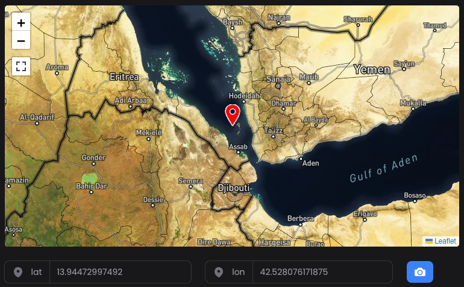

# Filament V3 Map Picker + Geoman Drawing Plugin

[![Latest Version on Packagist][ico-version]][link-packagist]
[![Total Downloads][ico-downloads]][link-downloads]
[![Software License][ico-license]][link-license]


## Introduction 

Map Picker is a custom field of Filament designed to simplify the process of selecting a location on a map and obtaining its 
geo-coordinates with the ease of having the Geoman plugin embedded in the map.

* Features include: 
   * A Field for Filament-v3 with Leaflet Map Integration
   * Receive Real-time Coordinates Upon Marker Movement Completion
   * Tailor Controls and Marker Appearance to Your Preferences
* Latest versions of PHP and Filament
* Best practices applied:
  * [`README.md`][link-readme] (badges included)
  * [`LICENSE`][link-license]
  * [`composer.json`][link-composer-json]
  * [`.gitignore`][link-gitignore]
  * [`pint.json`][link-pint]


## GeoMan Integration

This package now includes integration with GeoMan, a powerful tool for creating and editing geometries on maps. GeoMan allows users to draw various shapes, edit existing geometries, and perform advanced map editing tasks.

### GeoMan Features:

- Draw markers, polygons, polylines, and circles
- Edit existing geometries
- Cut polygons
- Rotate shapes
- Drag mode for easy shape manipulation
- Delete layers

## Supported Maps

Map Picker currently supports the following map:

1. Open Street Map (OSM)
2. Google Maps

## Installation

You can easily install the package via Composer:

```bash
composer require doode/filament-map-picker
```
## `Basic` Usage
Resource file:

```php
<?php
namespace App\Filament\Resources;

use Doode\MapPicker\Fields\Map;
...

class FilamentResource extends Resource
{
    ...
    public static function form(Form $form)
    {
        return $form->schema([
            Map::make('location')
                ->label('Location')
                ->columnSpanFull()
                ->defaultLocation(latitude: 52.8027, longitude: -1.0546)
                ->afterStateUpdated(function (callable $set, ?array $state): void {
                    $set('latitude', $state['lat']);
                    $set('longitude', $state['lng']);
                })
                ->afterStateHydrated(function ($state, $record, callable $set): void {
                    $set('location', ['lat' => $record->latitude, 'lng' => $record->longitude]);
                })
                ->extraStyles([
                    'min-height: 100vh',
                    'border-radius: 10px'
                ])
                ->liveLocation(true, true, 5000)
                ->showMarker()
                ->markerColor("#22c55eff")
                ->showFullscreenControl()
                ->showZoomControl()
                ->draggable()
                ->tilesUrl("https://tile.openstreetmap.de/{z}/{x}/{y}.png")
                ->zoom(13)
                ->detectRetina()
                ->showMyLocationButton()
                ->geoManToolbar(true)
                ->geoManEditable(true)
                ->geoManPosition('topleft')
                ->drawCircleMarker()
                ->rotateMode()
                ->clickable() //click to move marker
                ->drawText() //disabled by default
                ->drawMarker()
                ->drawPolygon()
                ->drawPolyline()
                ->drawCircle()
                ->dragMode()
                ->cutPolygon()
                ->editPolygon()
                ->deleteLayer()
                ->setColor('#3388ff')
                ->setFilledColor('#cad9ec')
           ]),
           
           // Field to store the geojson data
           Hidden::make('geomanbox')
    }
    ...
}
```

### `clickable` Option

This will allow you to set the point on the map with a click. Default behaviour has the marker centered as the map is
dragged underneath. You could, with this, keep the map still and lock the zoom and choose to click to place the marker.

```php
Map::make('location')
    ->defaultLocation(latitude: 52.8027, longitude: -1.0546)
    ->showMarker(true)
    ->clickable(true)
    ->tilesUrl("https://tile.openstreetmap.de/{z}/{x}/{y}.png")
    ->zoom(12)
```

### `rangeSelectField` Option

The rangeSelectField Option allows you to specify another field on your form which specifies a range from the point
identified by the marker.  That field must be in meters. So for example you could do this:

```php
Fieldset::make('Location')
    ->schema([
        Select::make('membership_distance')
            ->enum(MembershipDistance::class)
            ->options(MembershipDistance::class)
            ->required(),

        Map::make('location')
            ->defaultLocation(latitude: 40.4168, longitude: -3.7038)
            ->showMarker(true)
            ->showFullscreenControl(false)
            ->showZoomControl()
            ->tilesUrl("https://tile.openstreetmap.de/{z}/{x}/{y}.png")
            ->zoom(12)
            ->detectRetina()
            ->rangeSelectField('membership_distance')
            ->setFilledColor('#cad9ec'),
    ])
    ->columns(1),
```

In this case, as you change the value on the Select a circle of that radius centered on the marker will
change to match your drop down.


#### `liveLocation` Option

The `liveLocation` method accepts three parameters:

1. **`bool $send`:** Determines if the user's live location should be sent.
2. **`bool $realtime`:** Controls whether the live location should be sent to the server periodically.
3. **`int $milliseconds`:** Sets the interval (in milliseconds) at which the user's location is updated and sent to the server.

Example:

```php
Map::make('location')
    ->liveLocation(true, true, 10000)  // Updates live location every 10 seconds
    ->showMarker()
    ->draggable()
```

### boundaries Option

The idea here is that you can set a boundary box by defining two points, the southwest most point and the north east
most point, and your map will pan back into the panned area if you drag away, such that the points can only be selected
if you stay in the map.

You will want to set the minZoom() along with this if you set showZoomControl(true). To choose a good value for minZoom()
you will need to consider both the size of the map on the screen and the size of the bounding boxm, and you may find trial and
error is the best method.

```php
Map::make('location')
    ->showMarker()
    ->boundaries(true,49,11.1,61.0,2.1)
    ->draggable()
```

To turn it off again - possibly a strange use case - `boundaries(false)` is what you want.

### setBoundsToBritishIsles Option
This is a convenience function that uses the boundaries option above, setting the boundary box to
(49.5,-11) and (61,2)


## Options Table

Here's a table describing all available options and their default values:

| Option                  | Description                  | Default Value                                   |
|-------------------------|------------------------------|-------------------------------------------------|
| draggable               | Allow map dragging           | true                                            |
| showMarker              | Display marker on the map    | true                                            |
| tilesUrl                | URL for map tiles            | 'http://tile.openstreetmap.org/{z}/{x}/{y}.png' |
| attribution             | Map attribution text         | null                                            |
| zoomOffset              | Zoom offset                  | -1                                              |
| tileSize                | Tile size                    | 512                                             |
| detectRetina            | Detect and use retina tiles  | true                                            |
| minZoom                 | Minimum zoom level           | 0                                               |
| maxZoom                 | Maximum zoom level           | 28                                              |
| zoom                    | Default zoom level           | 15                                              |
| markerColor             | Color of the marker          | '#3b82f6'                                       |
| liveLocation            | Enable live location updates | [false, false, 5000]                            |
| showMyLocationButton    | Show "My Location" button    | false                                           |
| default                 | Default location             | ['lat' => 0, 'lng' => 0]                        |
| geoManToolbox.show      | Enable GeoMan                | false                                           |
| geoMan.editable         | Allow editing with GeoMan    | true                                            |
| geoMan.position         | Position of GeoMan controls  | 'topleft'                                       |
| geoMan.drawCircleMarker | Allow drawing circle markers | true                                            |
| geoMan.rotateMode       | Enable rotate mode           | true                                            |
| geoMan.drawText         | Allow drawing text blocks    | false                                           |
| geoMan.drawMarker       | Allow drawing markers        | true                                            |
| geoMan.drawPolygon      | Allow drawing polygons       | true                                            |
| geoMan.drawPolyline     | Allow drawing polylines      | true                                            |
| geoMan.drawCircle       | Allow drawing circles        | true                                            |
| geoMan.dragMode         | Enable drag mode             | true                                            |
| geoMan.cutPolygon       | Allow cutting polygons       | true                                            |
| geoMan.editPolygon      | Allow editing polygons       | true                                            |
| geoMan.deleteLayer      | Allow deleting layers        | true                                            |
| geoMan.color            | Stroke color for drawings    | '#3388ff'                                       |
| geoMan.filledColor      | Fill color for drawings      | '#cad9ec'                                       |


# New feature to capture image from the map


This is an example of the code in how to trigger the function in the map in order to capture the snapshot.
Note: Latitude and longitude are not mandatory, you can move the map and trigger the action to capture the image.

“If you have Geoman shapes drawn on your map, they will be included in the generated image.”
```php
Actions::make([
   Action::make('capture_map_image')
       ->hiddenLabel()
       ->icon('heroicon-m-camera')
       ->color('info')
       ->action(function (callable $get, $livewire) {
           $lat = $get('lat');
           $lon = $get('lon');

           if(!empty($lat) && !empty($lon)){
               $livewire->dispatch('captureMapImage');
           }
       })
   ])->columnSpan(1)
```
In your web.php file is necessary to add the route, i.e you can use a custom Controller
The map feature will post the blob image to this url /upload-map-image
```php
Route::post('/upload-map-image', [MapController::class, 'uploadMapImage'])->name('upload.map.image');
```


If you wish to update the map location and marker either through an action or after altering other input values, 
you can trigger a refresh of the map using the following approach:

```php

use Filament\Forms\Components\Actions\Action;
use Filament\Forms\Components\Actions;
use Filament\Support\Enums\VerticalAlignment;

Actions::make([
    Action::make('Set Default Location')
        ->icon('heroicon-m-map-pin')
        ->action(function (Set $set, $state, $livewire): void {
            $set('location', ['lat' => '52.8027', 'lng' => '-1.0546']);
            $set('latitude', '52.8027');
            $set('longitude', '-1.0546');
            $livewire->dispatch('refreshMap');
        })
])->verticalAlignment(VerticalAlignment::Start);

```

### Usage As Infolist Field

The MapEntry Infolist field displays a map.

```php
use Doode\MapPicker\Infolists\MapEntry;

public static function infolist(Infolist $infolist): Infolist
{
    return $infolist
        ->schema([
            MapEntry::make('location')
                ->extraStyles([
                    'min-height: 50vh',
                    'border-radius: 50px'
                ])
                ->state(fn ($record) => ['lat' => $record?->latitude, 'lng' => $record?->longitude])
                ->showMarker()
                ->iconSize(32)
                ->showGeomanToolbar()
                ->markerColor("#22c55eff")
                ->showFullscreenControl()
                ->draggable(false)
                ->zoom(15),

            .....
        ]);
}
```
<hr/>


## Usage Guide for Handling Map Locations

This section explains how to handle and display map locations within your application using this package.

**Step 1: Define Your Database Schema**

Ensure your database table includes latitude and longitude columns.
This is essential for storing the coordinates of your locations. You can define your table schema as follows:

```php
$table->double('latitude')->nullable();
$table->double('longitude')->nullable();
```

**Step 2: Retrieve and Set Coordinates**

When loading a record, ensure you correctly retrieve and set the latitude and longitude values.
Use the following method within your form component:

```php
->afterStateHydrated(function ($state, $record, Set $set): void {
    $set('location', ['lat' => $record?->latitude, 'lng' => $record?->longitude]);
})
```

**Step 3: Add Form Fields for Latitude and Longitude**

Add hidden form fields for latitude and longitude to your form. This ensures the values are present but not visible to the user:

```php
TextInput::make('latitude')->hidden(),
TextInput::make('longitude')->hidden()
```

If you prefer to display these values in a read-only format, replace `hidden()` with `readOnly()`.

### Alternative Approach: Using a Single Location Attribute

If you prefer to handle the location as a single field, you can define a custom attribute in your model. This method avoids the need for separate latitude and longitude columns:

```php
class YourModel extends Model
{
    protected function location(): Attribute
    {
        return Attribute::make(
            get: fn (mixed $value, array $attributes) => [
                'latitude' => $attributes['latitude'],
                'longitude' => $attributes['longitude']
            ],
            set: fn (array $value) => [
                'latitude' => $value['latitude'],
                'longitude' => $value['longitude']
            ],
        );
    }
}
```

This approach encapsulates both latitude and longitude within a single location attribute, streamlining your code.

# Updates for version 1.4.0 and above
### User can customize marker icons now, It is possible to use SVG or base64 encoded value
### User can set the marker size using `->iconSize()`

Example in how to use custom SVG Icon when "edit" a record from database

```php
                   Map::make('location')
                       ->hiddenLabel()
                       ->columnSpanFull()
                       ->defaultLocation(latitude: 52.8027, longitude: -1.0546)
                       ->afterStateHydrated(function (callable $set, callable $get, $state, ?Model $record) {
                           if ($record) {
                               // Icon base64_encoded value
                               $icon = YourModel::find($record->databasefield)->base64_image;

                               $set('location', [
                                       'lat' => $record->lat,
                                       'lng' => $record->lon,
                                       'icon' => $icon //Insert this icon key with the value
                                   ]);
                           }
                       })
                       ->extraStyles(['min-height: 30vh', 'border-radius: 5px'])
                       ->liveLocation(false, false, 5000)
                       ->showMarker()
                       ->iconSize(32)
                       ->markerColor("#FF0000")
                       ->showGeomanToolbar(false)
                       ->showFullscreenControl(true)
                       ->showZoomControl()
                       ->draggable()
                       ->tilesUrl(self::getMapBox())
                       ->zoom(6)
                       ->detectRetina()
                       ->showMyLocationButton(false)
                       ->extraControl(['zoomDelta' => 1, 'zoomSnap' => 2]),
```
Another way to update in real time if you have a list of icons in a dropdown list
You can display the icon in the list as well and use this icon to set as a marker in the map, like the example below.

```php
                    Select::make('category_id')
                        ->label('Category')
                        ->suffixIcon('heroicon-s-square-3-stack-3d')
                        ->options(function () {
                            return YourModel::where('is_active', true)->get()
                                ->mapWithKeys(function ($item) {
                                    return [
                                        $item->id =>
                                        "<div style='display: flex; align-items: center;'>
                                            base64_image}' alt='category_icon' style='width: 20px; height: 20px; margin-right: 8px;' />
                                            <span>{$item->name}</span>
                                        </div>",
                                    ];
                                })
                                ->toArray();
                        })
                        ->searchable()
                        ->allowHtml()
                        ->required()
                        ->reactive()
                        ->afterStateUpdated(function ($state, callable $set, callable $get, $livewire){
                            $model = YourModel::find($state);
                            if($model && $model->iconcolumnname) {
                                $livewire->dispatch('updateMarkerIcon', ['icon' => $category->iconcolumnname]);
                            } else {
                               $livewire->dispatch('updateMarkerIcon',['icon' => null]) ;
                            }
                        }),
```

You can do it in your way, just call `$livewire` and pass the parameter `'updateMarkerIcon'`


## License

[MIT License](LICENSE.md) © Doode

## Security

We take security seriously. 
If you discover any bugs or security issues, please help us maintain a secure project by reporting them through our [`GitHub issue tracker`][link-github-issue]. 
You can also contact us directly at [doode@doode.com.br](mailto:doode@doode.com.br).

## Contribution

We welcome contributions! contributions are what make the open source community such an amazing place to learn, inspire, and create. 
Any contributions you make are greatly appreciated.
If you have a suggestion that would make this better, please fork the repo and create a pull request. 
You can also simply open an issue with the tag "enhancement". Don't forget to give the project a star! Thanks again!

1. Fork the Project
2. Create your Feature Branch (`git checkout -b feature/AmazingFeature`)
3. Commit your Changes (`git commit -m 'Add some AmazingFeature'`)
4. Push to the Branch (`git push origin feature/AmazingFeature`)
5. Open a Pull Request


[ico-version]: https://img.shields.io/packagist/v/doode/filament-map-picker.svg?style=flat-square
[ico-license]: https://img.shields.io/badge/license-MIT-brightgreen.svg?style=flat-square
[ico-downloads]: https://img.shields.io/packagist/dt/doode/filament-map-picker.svg?style=flat-square

[link-workflow-test]: https://github.com/vitormicillo/filament-map-picker/actions/workflows/ci.yml
[link-packagist]: https://packagist.org/packages/vitormicillo/filament-map-picker
[link-license]: https://github.com/vitormicillo/filament-map-picker/blob/master/LICENSE.md
[link-downloads]: https://packagist.org/packages/vitormicillo/filament-map-picker
[link-readme]: https://github.com/vitormicillo/filament-map-picker/blob/master/README.md
[link-github-issue]: https://github.com/vitormicillo/filament-map-picker/issues
[link-docs]: https://github.com/vitormicillo/filament-map-picker/blob/master/docs/openapi.yaml
[link-composer-json]: https://github.com/vitormicillo/filament-map-picker/blob/master/composer.json
[link-gitignore]: https://github.com/vitormicillo/filament-map-picker/blob/master/.gitignore
[link-pint]: https://github.com/vitormicillo/filament-map-picker/blob/master/pint.json
[link-author]: https://github.com/vitormicillo
